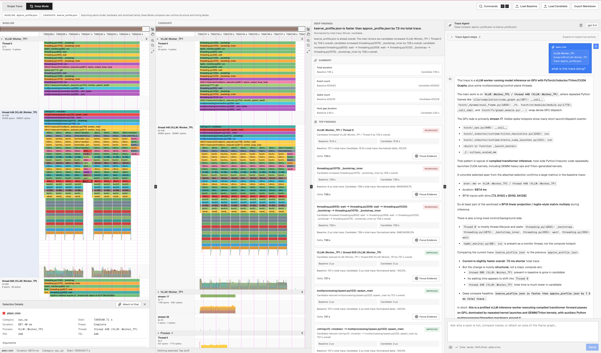

# lupa

[](https://github.com/albertoperdomo2/lupa/actions/workflows/ci.yml)

Local-first and portable flame graph viewer and trace agent for inspecting and comparing performance traces.



## Run It

```bash
curl -fsSL https://raw.githubusercontent.com/albertoperdomo2/lupa/main/scripts/install.sh | bash
```

This installs the `lupa` CLI, creates `~/.lupa/.env`, pulls the GHCR image, and starts the app at `http://lupa.localhost:3874`.

If you want the URL without a port:

```bash
lupa run --port 80
```

That gives you `http://lupa.localhost`.

Useful commands:

```bash
lupa status
lupa logs
lupa stop
lupa uninstall
```

Loaded runs persist locally on your device and are restored after reload until you clear them from the app.

## What It Does

- Load one or more trace JSON files as a single run and inspect them as an interactive flame graph.
- Ask `Trace Agent` technical questions about the current run.
- Compare `baseline` and `candidate` runs in `Deep Mode`.
- Focus findings directly in both flame graphs.

This tool uses a normalized trace-analysis path so the viewer and Trace Agent reason over the same event model. A run can contain multiple trace files, which makes it possible to inspect multi-pod or multi-process workloads as one workload sample instead of forcing file-by-file analysis. It reconstructs `B/E` spans before analysis, separates spans from spikes and counters in viewport summaries, and carries parent-chain, child, self-time, and call-path context into agent inspections so answers stay tied to visible evidence. It also ranks deterministic anomalies such as duration outliers, thread imbalance, repeated idle gaps, serialization, bursty micro-fragmentation, phase shifts, and counter-correlated regressions, which helps it surface weird bottlenecks instead of only restating the biggest hotspots.

## Local Development

```bash
pnpm install
cp .env.example .env
pnpm dev
```

Open `http://localhost:3000`.

If you want Trace Agent locally in dev mode, set your OpenAI key in `.env`:

```env
OPENAI_API_KEY=...
OPENAI_MODEL=gpt-5.4
```

## Notes

- The viewer works without the agent.
- Trace Agent requires a valid OpenAI API key.
- Deep Mode assumes comparable runs of the same workload and environment.
- Full runs persist in IndexedDB. Chat history persists in local storage.
- Use `Clear Saved Traces` when you want a clean local session.
